# IOS 抓包
### 安装抓包 App
#### 1. 前往 App Store 搜索"Stream" 下载安装
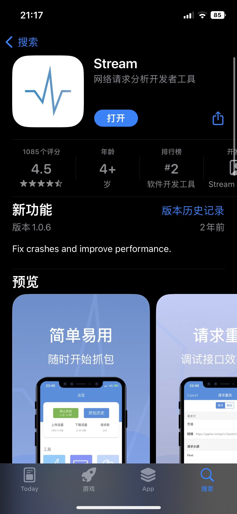

#### 2. 打开App

#### 配置 HTTPS 抓包
需要点击 app 首页 HTTPS 抓包 
* 需要手机安装证书
* 需要点击 清除缓存
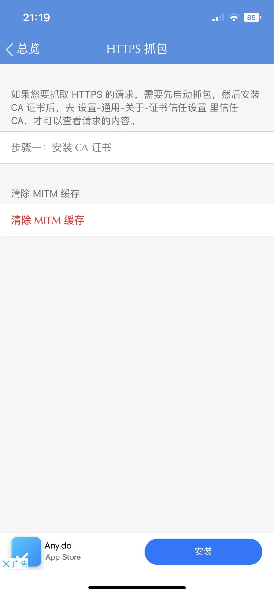

#### 点击安装 CA 证书
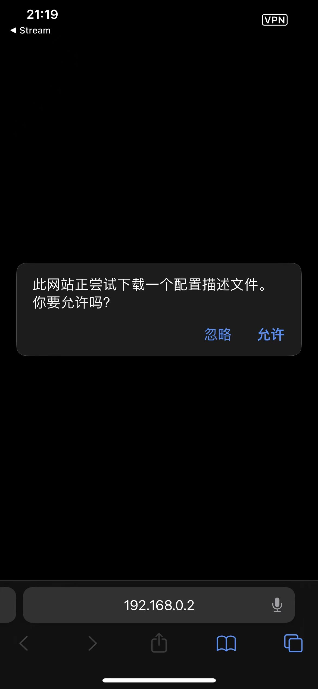
#### 选取设备 
选择 iPhone 
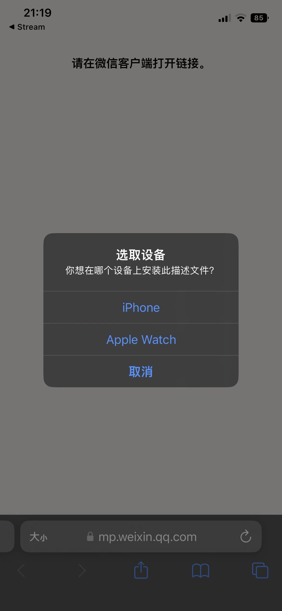
#### 提示"已下载描述文件"成功

### 
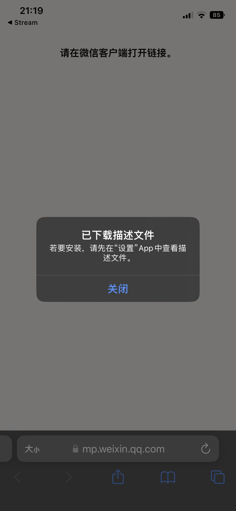

### ios手机设置证书
#### 设置描述文件
> 通用-VPN与设备管理-设置描述文件

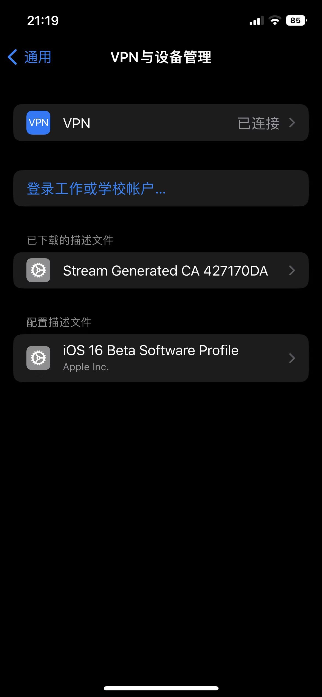
#### 选中刚刚下载的描述文件 "Stream Generated CA 427170DA"
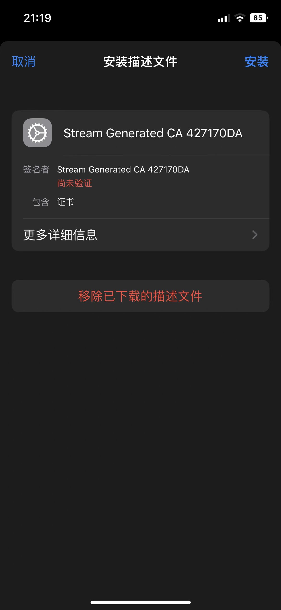

#### 点击安装证书

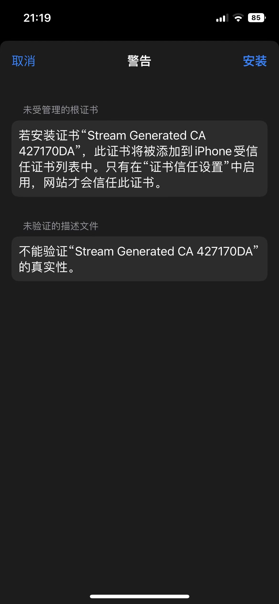

#### 找到 "证书信任设置" 
> 通用-关于本机-证书信任设置

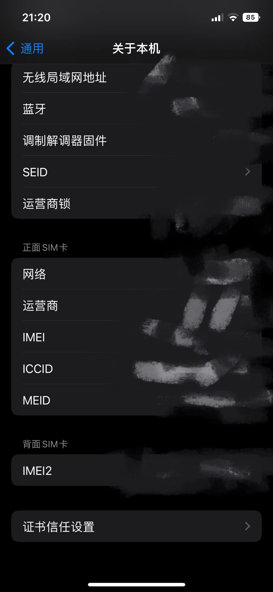

#### 启用完全信任证书 "Stream Generated CA 427170DA"
> 将下面 Stream Generated CA 427170DA 选项打开

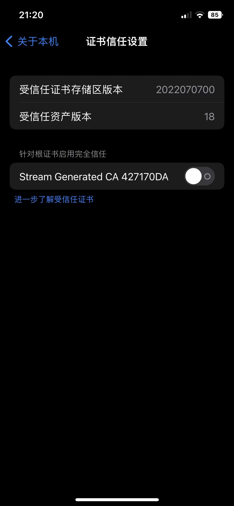

### 准备抓包
#### 重新打开 Stream 
> 点击 HTTPS 抓包 显示CA设置成功 

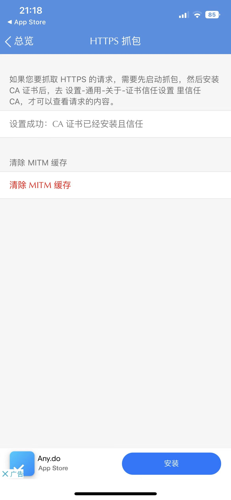

#### 点击 清除 MITM 缓存
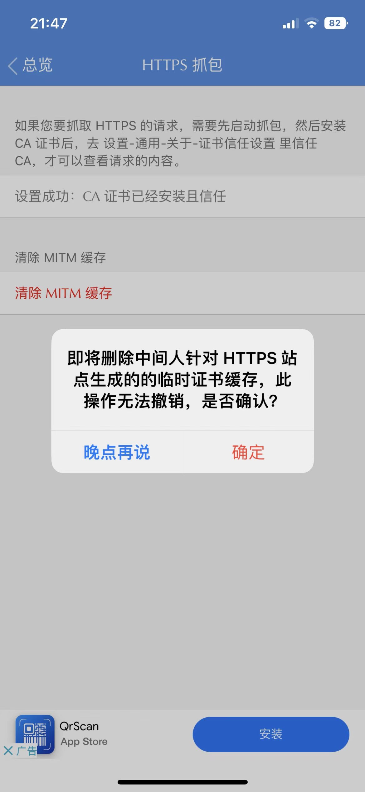

### 开始抓包
#### 点击开始抓包
> 点击开始抓包后, 打开微信小程序 

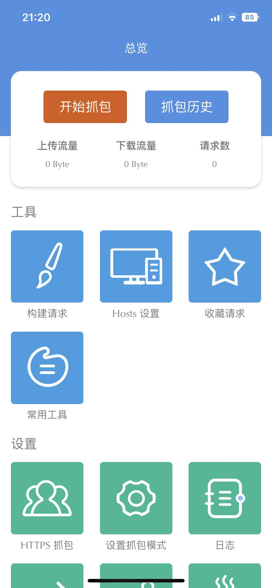

#### 进入游戏完成第一关
> 完成第一关后切换抓包工具

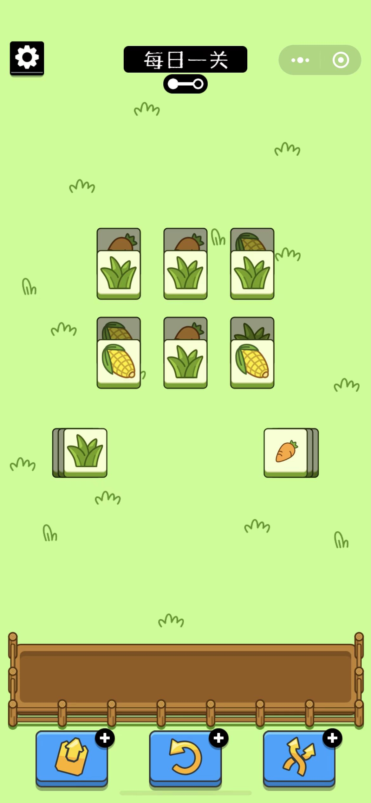

#### 查看抓包数据
> 点击抓包历史-选择最近抓包记录-按域名查询

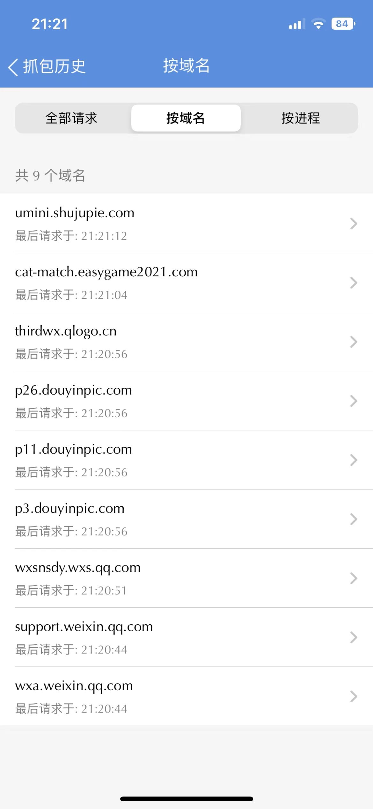

#### 找到域名"cat-match.easygame2021.com"

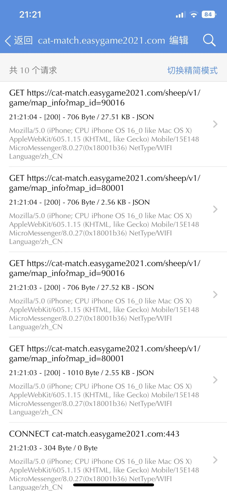

#### 在详情记录找到对应 t 数据, 后续代码要用到的 t 参数拷贝下来
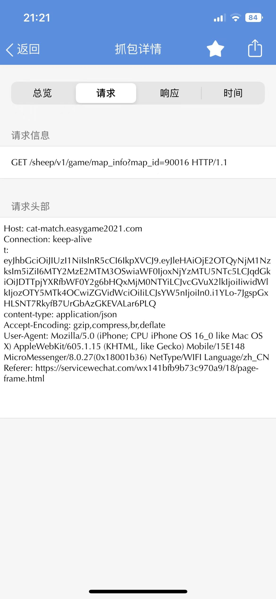
